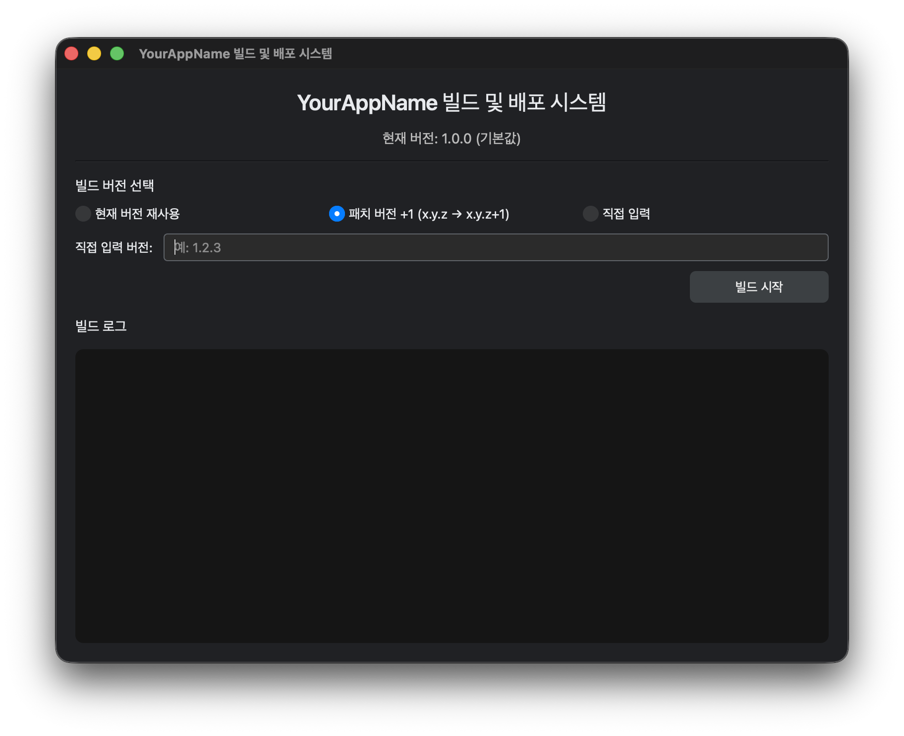

# py2exe

py2exe는 Python 스크립트를 Windows 실행 파일(.exe) 및 설치 프로그램으로 패키징하고, Cloudflare 배포 및 버전 관리를 자동화하기 위한 통합 도구 모음입니다. 



**PySide6 기반의 GUI 빌드 도구**와 **FastAPI 기반의 버전 관리 API 서버**를 동시에 포함하고 있어, 빌드부터 클라이언트 배포/업데이트 확인 릴리스 파이프라인까지 한 번에 관리할 수 있습니다.

## 주요 기능
- **GUI 기반 빌드 파이프라인**: PySide6 화면에서 버전을 선택(재사용/패치/+1/직접 입력)하고 버튼 클릭 한 번으로 PyInstaller 빌드 수행
- **멀티스레딩 빌드**: 빌드 프로세스가 비동기(QThread)로 실행되어 UI가 멈추지 않고, 실시간 콘솔 로그를 대시보드에서 확인 가능
- **인스톨러 자동 생성**: `Inno Setup(ISCC)`과 연동하여 빌드된 바이너리를 기반으로 표준 Windows 설치 파일(`.exe`)을 자동 빌드
- **원격 배포 자동화**: 빌드가 완료된 업데이트용 파일 및 설치 파일을 Cloudflare(R2/Workers 등)에 자동 업로드
- **중앙 집중식 버전 관리 서버**: FastAPI 서버를 통해 다중 애플리케이션의 최신 버전을 관리하고, 클라이언트의 업데이트 필요 여부(`update_required`) 판단 API 및 모니터링 웹 대시보드 제공

## 요구사항
- Windows 환경 (PyInstaller 바이너리 및 Inno Setup 컴파일러 실행용)
- **Inno Setup (ISCC)** 설치 및 환경 변수 등록 필요

## 설치 및 준비

### 1. 의존성 설치 및 가상환경 활성화 (uv 기준)

```bash
uv sync
# 가상환경 활성화
.venv\Scripts\activate     # Windows
```

### 2. 환경 변수 및 빌드 프로젝트 설정

`.env.example` 파일을 참고해 `.env` 파일을 프로젝트 루트 디렉터리에 생성하고 빌드 및 경로 설정 및 Cloudflare 인증 정보 등을 입력합니다.

> ⚠️ **중요 (빌드 대상 프로젝트 설정):**
> 실제 빌드를 진행하기 전에, `form/` 디렉터리에 있는 템플릿 파일들을 **실제 빌드할 대상 프로젝트의 루트 디렉터리로 복사(이동)**한 후 해당 프로젝트의 사양에 맞게 수정하여 사용해야 합니다.
> * **`build.spec`**: 빌드 대상 앱의 엔트리포인트 스크립트 경로 및 포함할 데이터 파일/에셋 경로를 프로젝트에 맞게 수정하세요.
> * **`setup.iss`**: 인스톨러 생성 시 반영될 프로그램 이름, 제작사 정보, 출력 경로 등을 프로젝트 사양에 맞게 변경하세요.

## 사용법

### 1. GUI 빌드 및 배포 시스템 (`main.py`)

```bash
python main.py
```

#### 주요 조작 방식:

1. **버전 모드 선택**:
* `현재 버전 재사용`: 이전 최종 빌드 버전을 덮어씁니다.
* `패치 버전 +1`: 기존 버전이 `1.0.1` 이라면 자동 분석 후 `1.0.2`로 넘버링을 올려 빌드합니다.
* `직접 입력`: 우측 텍스트박스에 유효한 유의적 버전(Semantic Versioning, 예: `1.2.0`)을 기입합니다.


2. **빌드 시작**: 버튼을 누르면 내부 백그라운드 스레드에서 아래의 파이프라인이 연속 실행됩니다.
* `PyInstaller` 구동 ➔ `_update.exe` 복사본 생성 ➔ Cloudflare 원격 업로드 ➔ `Inno Setup` 스크립트의 버전 매크로 갱신 ➔ `ISCC` 최종 인스톨러 빌드 ➔ 설치 파일 원격 업로드 완료.


3. 모든 과정과 에러 메시지는 하단 **빌드 로그** 뷰어에 실시간 스트리밍됩니다.

### 2. 버전 관리 API 서버 (`version/run.py`)

클라이언트 프로그램들이 켜질 때 업데이트가 필요한지 체크하는 백엔드 서버이자 관리 대시보드입니다.

```bash
cd version
python run.py
```

*서버는 기본적으로 `http://0.0.0.0:3009` 포트에서 호스팅됩니다.*

#### 엔드포인트 안내:

* **`GET /dashboard`**: 현재 등록된 모든 애플리케이션의 최신 버전을 시각적으로 확인하는 Jinja2 템플릿 웹 페이지
* **`GET /api/versions`**: `versions.json`에 기록된 전체 앱 목록 및 버전 조회
* **`GET /api/version/{app_name}`**: 특정 앱의 최신 버전 단독 조회
* **`POST /api/version`**: 특정 앱의 최신 버전을 강제 수동 업데이트/등록 (JSON payload)
