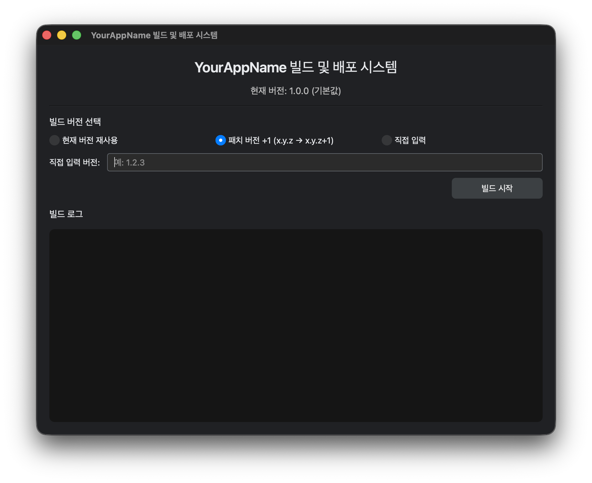

# py2exe

Python 앱을 Windows 실행 파일(.exe)과 설치 프로그램으로 패키징하고, Cloudflare R2 업로드와 버전 관리까지
버튼 하나로 처리하는 통합 도구입니다.



- **GUI 빌드 도구 (`main.py`)** – PySide6. 앱 선택 → 버전 선택 → 빌드/배포 파이프라인 실행, 실시간 로그, 취소.
- **CLI (`builder.py`, `cloudflare.py`)** – 같은 파이프라인을 터미널/CI 에서 실행.
- **버전 관리 API 서버 (`version/run.py`)** – FastAPI. 클라이언트 앱이 업데이트 필요 여부를 확인하는 API 와 웹 대시보드.

## 파이프라인

```
PyInstaller 빌드 ─▶ <App>_<ver>_update.exe 복사 ─▶ Inno Setup 인스톨러 ─▶ R2 업로드 ─▶ 버전 서버 등록
   (필수)                 (필수)                     (옵션)              (옵션)         (옵션)
```

산출물 위치 (앱별 `PROJECT_DIR` 기준 기본값):

| 종류 | 경로 |
|---|---|
| PyInstaller 결과 폴더 | `exe/<App>_<ver>/` |
| 업데이트용 단일 exe | `exe/<App>_<ver>_update.exe` |
| Inno Setup 인스톨러 | `output/<App>_<ver>.exe` |

## 요구 사항

- Python 3.11+ (uv 권장)
- Windows: PyInstaller 로 exe 를 만들고 Inno Setup 을 실행하려면 Windows 가 필요합니다.
  (GUI/버전 서버/테스트 자체는 다른 OS 에서도 실행됩니다.)
- [Inno Setup 6](https://jrsoftware.org/isinfo.php) – 인스톨러를 만들 때만 필요. 기본 설치 경로·PATH 에서 자동 탐색합니다.
- 빌드 대상 프로젝트의 가상환경에 `pyinstaller` 가 설치되어 있어야 합니다.

## 설치

```bash
uv sync                # 런타임 의존성
uv sync --group dev    # + pytest, httpx (테스트용)
```

## 설정

### 1) `config.json` – 빌드할 앱 목록

`config.example.json` 을 복사해 `config.json` 을 만듭니다. **필수 값은 `APP_NAME` 과 `PROJECT_DIR` 두 개뿐**이고 나머지는
기본값이 있습니다. 상대 경로는 `PROJECT_DIR` 기준이며 `~` 와 환경변수를 쓸 수 있습니다.

```json
{
  "common": {
    "INNO_SETUP_EXE": "C:/Program Files (x86)/Inno Setup 6/ISCC.exe",
    "VERSION_API_URL": "http://localhost:3009"
  },
  "apps": [
    { "APP_NAME": "MyApp", "PROJECT_DIR": "C:/GitHub/myapp" }
  ]
}
```

| 키 | 기본값 | 설명 |
|---|---|---|
| `APP_NAME` | (필수) | 앱 이름. 파일명에 쓰이므로 영문/숫자/`._-` 만 |
| `PROJECT_DIR` | (필수) | 빌드 대상 프로젝트 루트 |
| `VENV_PYTHON` | `.venv`/`venv`/`env` 자동 탐색 | PyInstaller 가 설치된 파이썬 |
| `EXE_DIRECTORY` | `exe` | PyInstaller 출력 폴더 |
| `OUTPUT_DIRECTORY` | `output` | 인스톨러 출력 폴더 |
| `SPEC_FILE` | `build.spec` | PyInstaller spec (구 `DEFAULT_SPEC_NAME` 도 인식) |
| `ISS_FILE` | `setup.iss` | Inno Setup 스크립트 (구 `DEFAULT_ISS_NAME` 도 인식) |
| `ICON_PATH` | `assets/imgs/icon.ico` | 인스톨러 아이콘. 없으면 아이콘 없이 진행 |
| `EXE_NAME` | `APP_NAME` | spec 의 `EXE(name=...)` 을 다르게 쓰고 싶을 때 |
| `VERSION_PATTERN` | `^<App>_(\d+(?:\.\d+)*)$` | `exe/` 폴더 이름에서 버전을 뽑는 정규식 |
| `BASE_URL` | `.env` 의 `R2_PUBLIC_BASE_URL` | 버전 서버 등록 시 다운로드 주소 (신규 앱은 필수) |
| `UPLOAD_PREFIX` | (없음) | R2 객체 키 앞에 붙일 폴더 (`releases/myapp`) |

`common` 의 값은 같은 이름의 환경변수(`INNO_SETUP_EXE`, `VERSION_API_URL`)로 덮어쓸 수 있고, 설정 파일 위치는
`PY2EXE_CONFIG` 환경변수로 바꿀 수 있습니다.

### 2) `.env` – Cloudflare R2 인증 정보

R2 업로드를 쓸 때만 필요합니다. `.env.example` 참고.

```
ACCESS_KEY_ID=...
SECRET_ACCESS_KEY=...
ACCOUNT_ID=...
BUCKET_NAME=...
R2_PUBLIC_BASE_URL=https://pub-xxxx.r2.dev   # 선택
```

### 3) 빌드 대상 프로젝트에 템플릿 복사

`form/build.spec` 과 `form/setup.iss` 를 **빌드할 프로젝트 루트**로 복사한 뒤 프로젝트에 맞게 수정합니다.

- **`build.spec`**: `MAIN_SCRIPT`, `datas`, `hiddenimports` 만 손보면 됩니다.
  `EXE(name=)`, `COLLECT(name=)`, `APP_PATH` 는 빌드 시 자동으로 채워지므로 값에 무엇이 적혀 있든 상관없습니다.
  `COLLECT` 가 없는 onefile spec 도 지원합니다.
- **`setup.iss`**: `MyAppPublisher` 등 고정 정보만 수정합니다. `#ifndef` 로 감싼 값
  (`MyAppName`, `MyAppVersion`, `MyAppExeName`, `BuildDir`, `OutputDir`, `SourceIconPath`)은 빌드 시 `/D` 로 주입됩니다.
  기존에 쓰던 iss 파일이 있다면 그대로 써도 됩니다 – `#define MyAppVersion` 줄만 있으면 버전이 교체됩니다.

## 사용법

### GUI

```bash
uv run python main.py
```

1. 상단에서 **앱**을 고릅니다. 현재 빌드 버전, 경로, 도구 감지 상태가 표시됩니다.
2. **빌드 버전**: 현재 버전 재사용 / 패치 +1 / 직접 입력. 빌드될 버전이 미리 표시됩니다.
3. **배포 옵션**
   - Inno Setup 인스톨러 생성 – 끄면 PyInstaller 결과와 `_update.exe` 만 만듭니다.
   - Cloudflare R2 업로드 – `.env` 가 설정돼 있으면 기본 켜짐.
   - 업데이트도 전체 설치 파일로 배포 – 인스톨러를 `_update.exe` 이름으로도 업로드합니다.
   - 버전 서버에 최신 버전 등록 – `VERSION_API_URL` 이 있으면 기본 켜짐.
4. **빌드 시작**. 빌드 전에 spec/iss/ISCC/인증 정보를 먼저 검사해서 문제가 있으면 바로 알려줍니다.
   진행 중에는 **취소**로 중단할 수 있습니다.

### CLI

```bash
uv run python builder.py                       # 등록된 앱 목록
uv run python builder.py MyApp                 # 패치 +1 로 전체 파이프라인
uv run python builder.py MyApp --version 2.0.0 --register
uv run python builder.py MyApp --no-installer --no-upload   # 로컬 빌드만

uv run python cloudflare.py --app MyApp --latest             # output 폴더의 최신 인스톨러 업로드
uv run python cloudflare.py --app MyApp --version 1.2.3 --with-update
uv run python cloudflare.py --file path/to/file.exe --key releases/file.exe
```

### 버전 관리 서버

```bash
cd version
uv run python run.py            # http://0.0.0.0:3009
```

환경변수: `VERSION_API_HOST`, `VERSION_API_PORT`, `VERSION_API_RELOAD=1`, `VERSIONS_FILE`.

| 메서드 | 경로 | 설명 |
|---|---|---|
| GET | `/dashboard` | 앱 목록/버전 관리 웹 대시보드 (`/` 는 여기로 리다이렉트) |
| GET | `/health` | 상태 확인 |
| GET | `/api/versions` | 전체 앱 목록 |
| GET | `/api/version/{app}` | 특정 앱 최신 버전 |
| GET | `/api/version/{app}/check?client_version=1.0.0` | 업데이트 필요 여부 (`update_required`) |
| POST | `/api/version` | 최신 버전 등록. `{app_name, version, base_url?}` – 신규 앱은 `base_url` 필수, 기존 앱은 주면 갱신 |
| DELETE | `/api/version/{app}` | 앱 삭제 |

클라이언트 앱에서는 시작 시 `/api/version/{app}/check` 를 호출해 `update_required` 가 참이면 `update_url`
(단일 exe) 또는 `download_url`(인스톨러)을 받아 갱신하면 됩니다.

## 테스트

```bash
uv run --group dev pytest
```

빌드 로직(버전 계산, spec/iss 치환, 서브프로세스 취소, 설정 검증)과 버전 API 를 검증합니다. PyInstaller/Inno Setup 실행은 포함하지 않습니다.

## 구조

```
main.py            PySide6 GUI (워커 스레드에서 BuildPipeline 실행)
builder.py         빌드 파이프라인 + CLI
config.py          config.json / .env 로딩·검증 (AppConfig, Settings)
cloudflare.py      R2 업로더 + CLI
version_client.py  버전 서버 호출
version/run.py     FastAPI 버전 서버
form/              build.spec, setup.iss 템플릿
tests/             pytest
```
